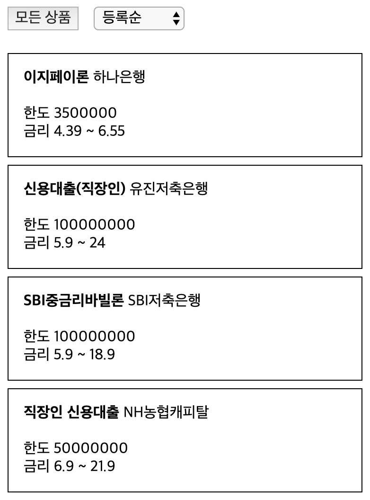

# 클린코드 실습 - 상품 리스트 만들기

## 상품 데이터
```js
{
    id: 1,
    name: '이지페이론',
    organization: '하나은행',
    limit: 3500000,
    interest: {
        min: 4.39,
        max: 6.55
    },
    is_prime: true
}
```

- id: 상품 등록 순서
- name: 대출 상품 이름
- organization: 금융사 이름
- limit: 대출 한도
- interest: 금리 최대(max)/최저(min) 값
- is_prime: 1 금융권(은행) 여부


## 요구 사항
1. 상품 데이터(`loans`)를 기반으로 상품 리스트를 구현하라
2. 은행 여부(`is_prime`)로 리스트를 필터링할 수 있는 기능을 구현하라
3. 등록 순서(`id`), 낮은 금리(`interest.min`), 한도(`limit`)로 리스트를 정렬할 수 있는 기능을 구현하라
4. 필터가 변경될 때 '데이터 명세'를 기준으로 로그를 남겨 유저의 행동을 추적하라

### 로그 데이터 명세
```js
{
  screen_name: 'loans_page',
  number_of_loans: 3,
  filter_name: 'prime_only' || 'all',
  event_name: 'click_filter'
}
```

- screen_name: 페이지 고유 이름
- number_of_loans: 노출된 상품의 수
- filter_name: 적용된 필터 값
- event_name: 유저의 행동(이벤트) 이름

#### 샘플 UI

